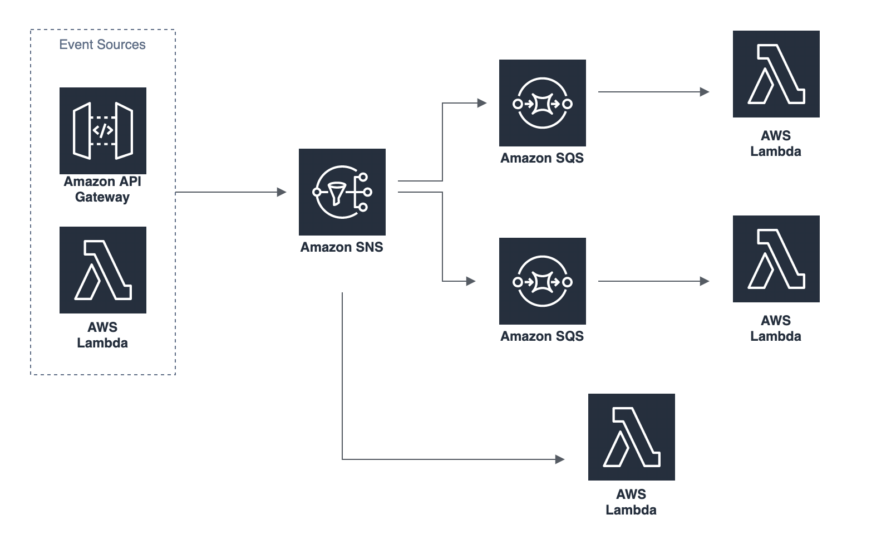

# Serverless SNS SQS offline Example
A [Serverless](https://serverless.com/) application that demonstrate the flow of amazon SQS, SNS and lambda. 

## Architecture


## Setup
Instead of declare the AWS access key and secret in the serverless.yml, we use the default [AWS profile](https://docs.aws.amazon.com/sdk-for-php/v3/developer-guide/guide_credentials_profiles.html) for development and deployment to hide our keys. Fill in your own profile if you are not using the default profile.

We are using [ElasticMQ](https://github.com/softwaremill/elasticmq), an in-memory message queue system, with serverless-offline-sqs plugin to simulate the local AWS SQS environment. We have provided a docker-compose file to establish the ElasticMQ service. 

```sh 
$ cd ./elasticMQ
$ docker-compose up -d
```

### Development
We are using [nodemon](https://www.npmjs.com/package/nodemon) for hot loading and [serverless-offline](https://www.npmjs.com/package/serverless-offline) to simulate the lambda environment.

```sh
$ npm install
$ npm run dev
```

### Deploy

```sh
$ npm install
$ npm run deploy
```

## ToDo List
- [ ] Better Documentation
- [ ] Replace the wild class on iamRoleStatements in serverless.yml
- [ ] Test cases
- [ ] CICD pipeline

## Remark
There may be a bug on serverless-webpack that [it isn't work to use webpack.DefinePlugin to declare the environment variable](https://github.com/serverless-heaven/serverless-webpack/issues/274).

## License
This software is released under the MIT license. See the [license file](LICENSE) for more details.

